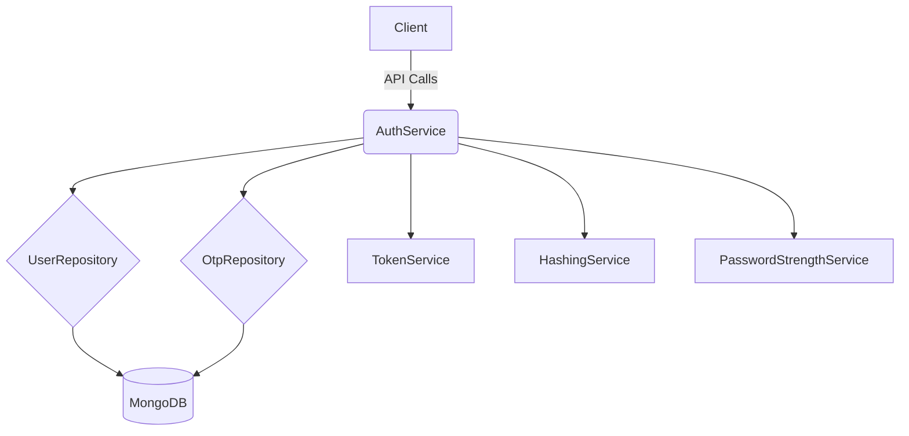
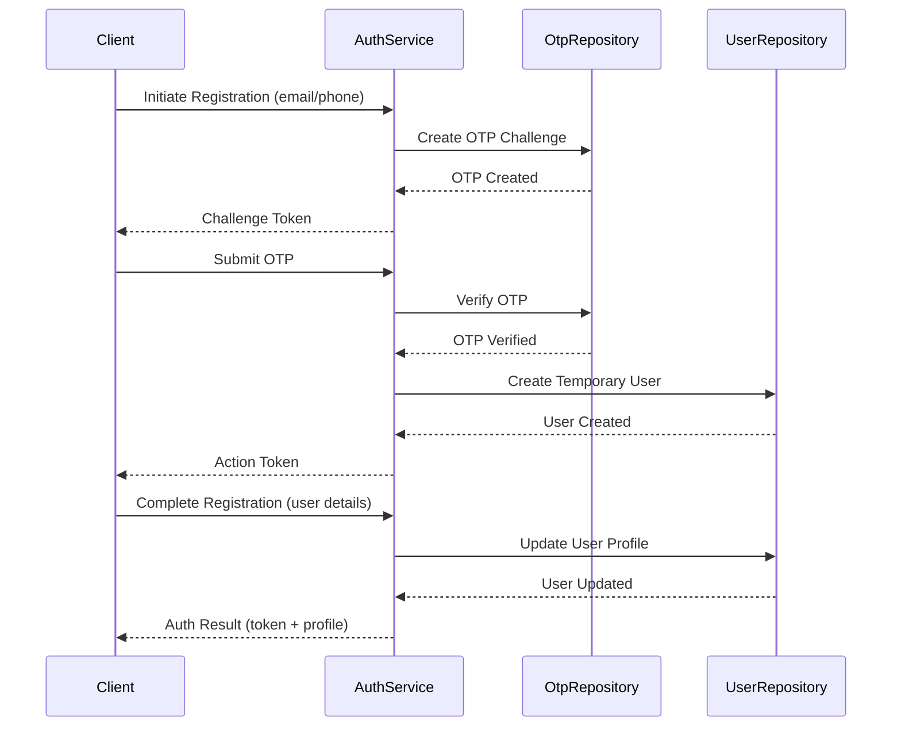
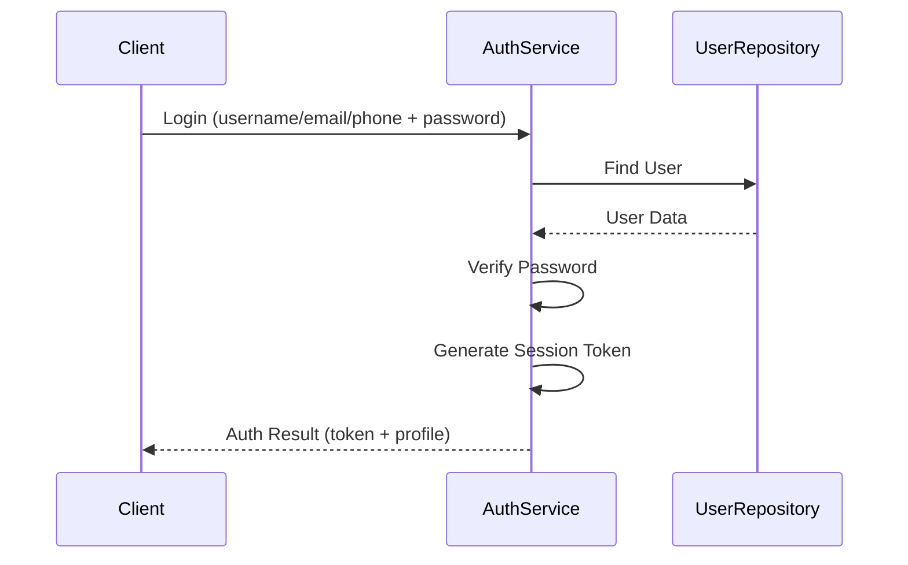
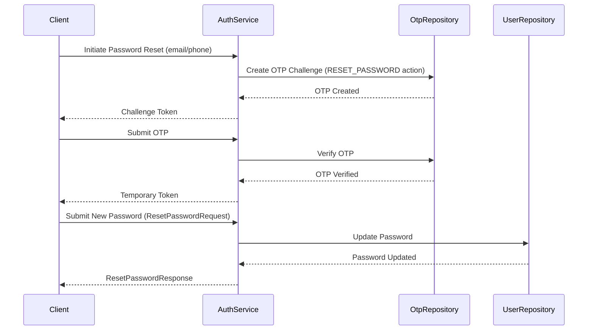
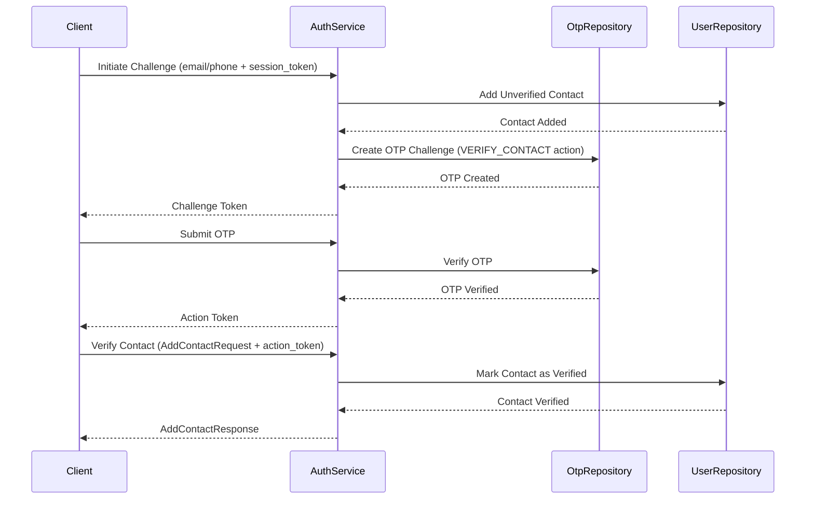
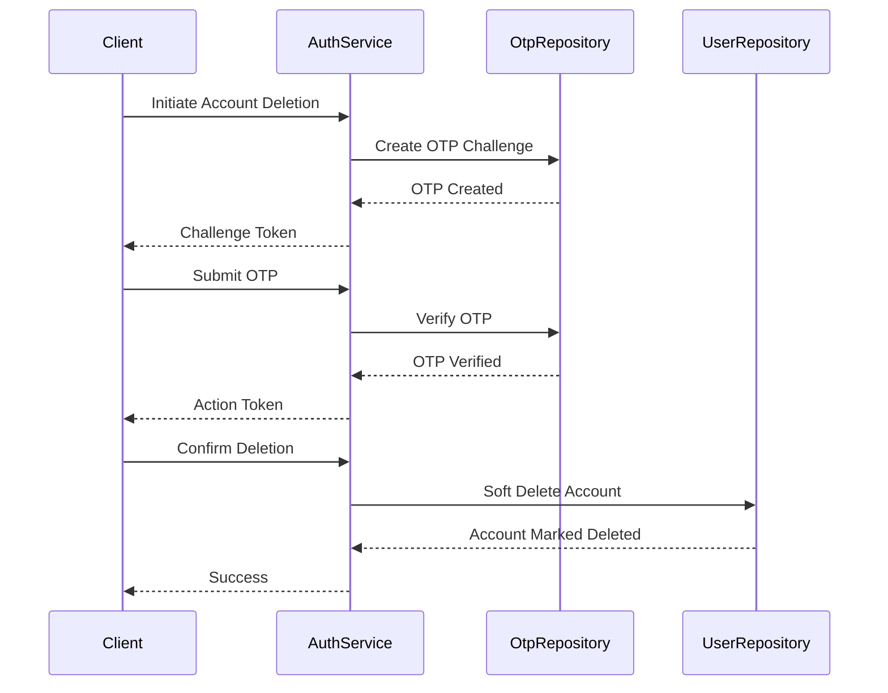

# Authentication Feature

This module provides user authentication and account management functionality, including registration, login, password management, and account recovery.

## Features

- User registration with email/phone verification
- Login with username/email/phone
- Password management (update, reset) with password history
- Account recovery and deletion
- Role-based access control
- Multi-factor authentication via OTP
- Profile management
- Failed login attempt tracking and account lockout
- Password strength validation

## Architecture



## Key Components

1. **AuthService**: Core service handling authentication logic
2. **UserRepository**: Manages user data persistence including password history and failed login attempts
3. **OtpRepository**: Handles OTP generation and verification
4. **TokenService**: Manages JWT tokens for authentication
5. **HashingService**: Handles password hashing and verification
6. **PasswordStrengthService**: Validates password strength during registration and password changes

## Security Features

- Password hashing with salt
- Password history tracking to prevent reuse
- Account lockout after 5 failed login attempts
- Secure token management with expiration
- OTP verification for sensitive operations
- Password strength validation

## Registration Flow



### Registration Flow Explanation

1. **Initiation**: User provides email/phone to start registration
2. **OTP Creation**: System generates and stores a one-time password
3. **Verification**: User submits received OTP for verification
4. **Temporary User**: A temporary user record is created
5. **Profile Completion**: User provides remaining profile details
6. **Finalization**: User record is updated and authentication tokens are returned

## Login Flow



### Login Flow Explanation

1. **Credentials Submission**: User provides login credentials
2. **User Lookup**: System finds user by username/email/phone
3. **Password Verification**: System verifies provided password
4. **Token Generation**: Session token is generated for authenticated user
5. **Response**: Authentication result with token and profile is returned

## Password Reset Flow



### Password Reset Flow Explanation

1. **Initiation**: User requests password reset with email/phone
2. **OTP Creation**: System generates and stores a one-time password with RESET_PASSWORD action
3. **Verification**: User submits received OTP for verification
4. **Authorization**: Temporary token is generated for password change
5. **Password Update**: User submits new password which is securely stored
6. **Completion**: Success response is returned

## Add Contact Flow



### Add Contact Flow Explanation

1. **Initiation**: 
   - User provides email/phone and session token
   - System adds unverified contact to user's profile
   - Creates OTP challenge for verification

2. **OTP Creation**: 
   - System generates and stores a one-time password
   - Returns challenge token to client

3. **Verification**: 
   - User submits received OTP
   - System verifies OTP and returns action token

4. **Contact Verification**: 
   - User submits action token to verify contact
   - System marks contact as verified

5. **Completion**: 
   - Success response is returned

Key Points:
- Requires valid session token
- Contact is initially added as unverified
- Must complete OTP verification to mark as verified
- Prevents duplicate contacts
- Supports both email and phone contacts

## Account Deletion Flow



### Account Deletion Flow Explanation

1. **Initiation**: User requests account deletion
2. **OTP Creation**: System generates and stores a one-time password
3. **Verification**: User submits received OTP for verification
4. **Authorization**: Action token is generated for account deletion
5. **Soft Delete**: User account is marked as deleted but retained for recovery
6. **Completion**: Success response is returned

## Role Management

Users can have multiple roles (e.g., "viewer", "creator"). Roles are stored as a list of strings in the user entity.

### Role Operations

- Add role: `POST /auth/roles`
- Remove role: `DELETE /auth/roles/{role}`
- Get roles: `GET /auth/roles`

## API Documentation

### Endpoints

| Method | Path                 | Description                |
|--------|----------------------|----------------------------|
| POST   | /auth/register       | Start registration process |
| POST   | /auth/login          | Login with credentials     |
| POST   | /auth/password/reset | Initiate password reset    |
| PUT    | /auth/password       | Update password            |
| DELETE | /auth/account        | Delete account             |
| GET    | /auth/profile        | Get user profile           |
| PUT    | /auth/profile        | Update user profile        |
| POST   | /auth/roles          | Add role to user           |
| DELETE | /auth/roles          | Remove role from user      |
| GET    | /auth/roles          | Get user roles             |

## Configuration

Environment Variables:

- `MONGO_DB_URI`: MongoDB connection string
- `JWT_SECRET`: Secret for JWT token generation
- `JWT_ISSUER`: JWT issuer
- `JWT_AUDIENCE`: JWT audience
- `MAX_FAILED_LOGIN_ATTEMPTS`: Maximum failed login attempts before lockout (default: 5)
- `PASSWORD_HISTORY_SIZE`: Number of previous passwords to store (default: 5)

## Testing

Run tests with:

```bash
cargo test --features auth
```

Key test cases:

- User account lifecycle
- Password strength validation
- OTP verification
- Role management
- Failed login attempt tracking
- Password history validation 